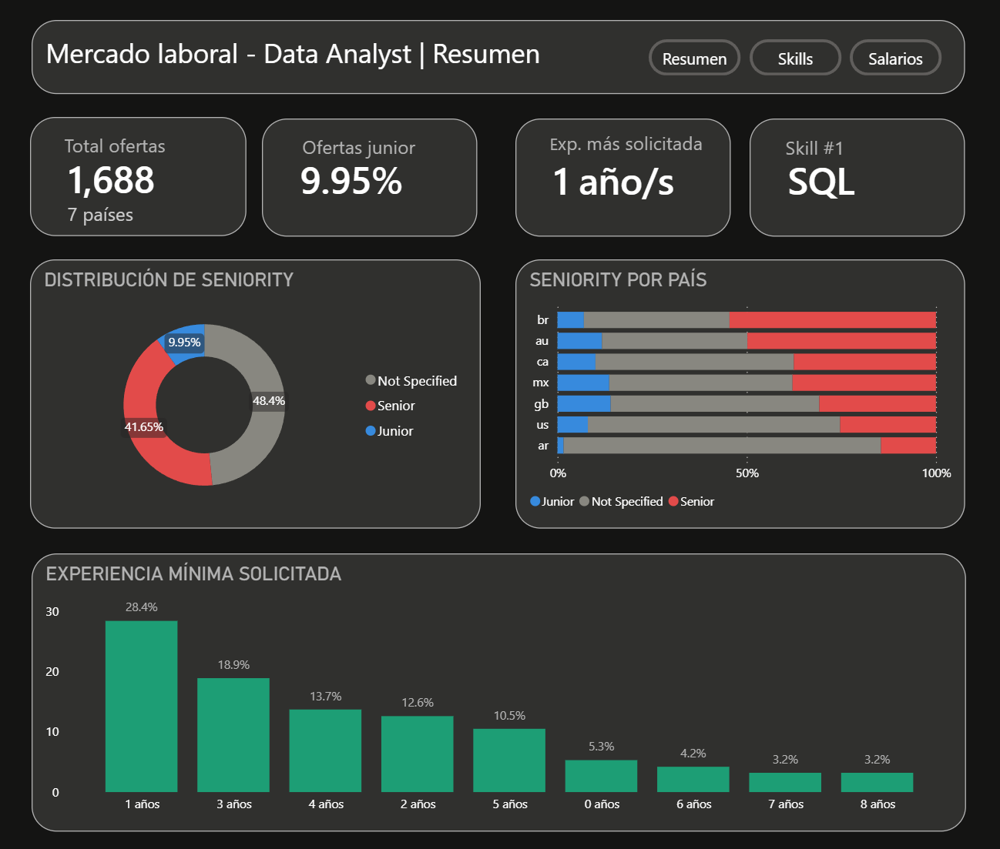
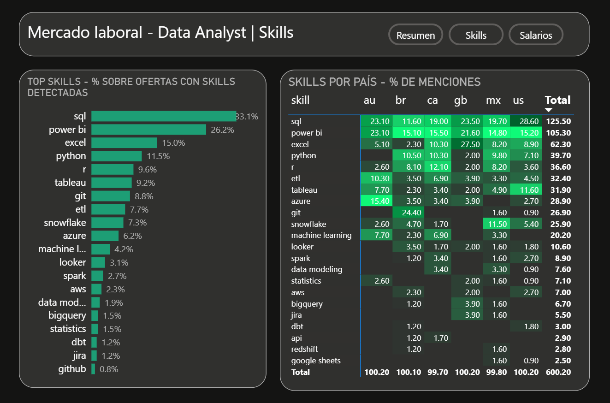
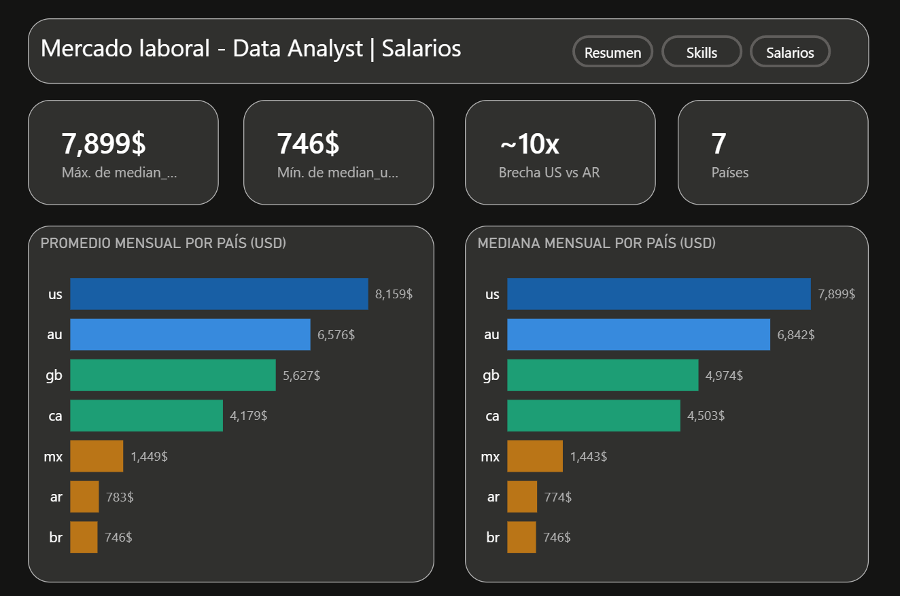

# Análisis del Mercado Laboral - Data Analyst


Proyecto end-to-end de análisis del mercado laboral para el rol de Data Analyst.
Extrae ofertas de trabajo reales mediante API y web scraping, las carga en una
base de datos SQLite, las transforma y analiza con Python, y exporta los resultados
para un dashboard en Power BI.

---

## Estructura del proyecto
```
analisis-mercado-laboral/
│
├── data/
│   ├── jobs.db                  # Base de datos SQLite con datos crudos y limpios
│   └── processed/               # CSVs exportados para Power BI
│       ├── 1_skills_aggregated.csv
│       ├── 2_seniority_distribution.csv
│       ├── 3_experience_distribution.csv
│       ├── 4_skills_by_country.csv
│       ├── 5_salary_by_country.csv
│       └── 6_jobs_clean.csv
│
├── dashboard/
│   └── assets/                  # Gráficos exportados del notebook
│       ├── 3_1_skills_demandadas.png
│       ├── 3_2_seniority.png
│       ├── 3_3_experiencia.png
│       ├── 3_4_paises.png
│       └── 3_5_salario_paises.png
│
├── db/
│   └── schema.sql               # Schema de la base de datos
│
├── notebooks/
│   └── 01_eda.ipynb             # Exploración, limpieza y análisis
│
├── src/
│   ├── extract/
│   │   ├── adzuna.py            # Extracción via Adzuna API
│   │   └── computrabajo.py      # Scraping de Computrabajo
│   └── load/
│       └── loader.py            # Carga a SQLite
│
├── LICENSE
├── poetry.lock
├── .env.example                 # Variables de entorno requeridas
├── pyproject.toml               # Dependencias del proyecto (Poetry)
└── README.md
```

---

---

## ¿Qué contiene este proyecto?

### 1. Pipeline de extracción (`src/`)
- Extracción de ofertas via Adzuna API REST (US, GB, AU, CA, BR, MX)
- Web scraping de Computrabajo (Argentina)
- Carga automática a SQLite con control de duplicados
- Genera `data/jobs.db` listo para el análisis

### 2. Análisis exploratorio (`notebooks/01_eda.ipynb`)
- Limpieza y normalización de datos (fechas, salarios, modalidad)
- Detección de skills via NLP con lista predefinida y regex
- Análisis de seniority, experiencia solicitada y distribución por país
- Conversión de salarios a USD mensual con tipo de cambio en tiempo real

### 3. Visualizaciones
- Gráficos de barras, heatmaps y distribuciones con matplotlib y seaborn
- Exportación de datos agregados a `data/processed/` como fuente del dashboard

### 4. Dashboard en Power BI (`dashboard/`)




---

## Objetivo

Responder preguntas concretas sobre el mercado laboral para Data Analyst:

- ¿Qué skills son las más demandadas?
- ¿Qué tan accesible es el mercado para perfiles junior?
- ¿Cuánta experiencia se solicita?
- ¿Cómo varía el mercado por país?
- ¿Cuál es la brecha salarial entre países?

---

## Insights principales

- **SQL es innegociable:** SQL es la skill más demandada en todos los mercados.
- **El mercado no espera Juniors:** Solo el 10% de las ofertas son explícitamente junior.
- **Experiencia mínima:** La experiencia más solicitada es entre **1 y 3 años.**
- **Brecha salarial:** Estados Unidos lidera en salarios con una mediana de **$7.899 USD mensuales.** La brecha entre US y Argentina es de **10 veces.**

---

## Stack tecnológico

| Herramienta | Uso |
|-------------|-----|
| Python 3.12 | Análisis, visualización y pipeline de datos |
| pandas, re | Manipulación, limpieza y NLP básico |
| matplotlib / seaborn | Visualizaciones exploratorias |
| Jupyter Notebook | Entorno de desarrollo |
| Power BI | Dashboard ejecutivo |
| SQLite | Base de datos local |
| Poetry | Gestión del entorno virtual y dependencias |
| requests / BeautifulSoup | Extracción via API y scraping |

---

## Instalación y uso

### Requisitos previos

- Python 3.12 - [descargar acá](https://www.python.org/downloads/)
- Poetry - [descargar acá](https://python-poetry.org/docs/#installation)
- Credenciales gratuitas de Adzuna API

### 1. Clonar el repositorio

```bash
git clone https://github.com/JackyDye/analisis-mercado-laboral
cd analisis-mercado-laboral
```

### 2. Instalar dependencias

```bash
poetry install
```

### 3. Configurar credenciales

Ingresa tus credenciales de Adzuna en el `.env.example` y cambiasu nombre a `.env`

```bash
ADZUNA_APP_ID=tu_app_id_aqui
ADZUNA_APP_KEY=tu_app_key_aqui
```

Registrate gratis en [developer.adzuna.com](https://developer.adzuna.com/signup).

### 4. Correr el pipeline

```bash
poetry run python -m src.load.loader
```

Esto extrae las ofertas, las carga en `data/jobs.db` y está listo para el análisis.

### 5. Abrir el notebook

```bash
poetry run jupyter notebook notebooks/01_eda.ipynb
```

---

## ⚠️ Advertencia sobre la ejecución

Si decides ejecutar el pipeline y luego el notebook, los datos serán distintos a los del análisis original y los gráficos generarán resultados diferentes. Esto es esperable, las ofertas de trabajo
cambian diariamente y cada ejecución produce un dataset nuevo.

Los insights documentados en el notebook reflejan exclusivamente los datos recolectados
entre mayo y junio de 2026.

Además, la API gratuita de Adzuna trunca las descripciones a 500 caracteres, lo que limita
el análisis de skills. Si contás con una cuenta paga, podés obtener descripciones completas
y los resultados serán significativamente más representativos de la realidad del mercado.

---

## Limitaciones conocidas

- La API gratuita de Adzuna trunca las descripciones a 500 caracteres, lo que
  subestima la detección de skills. Los resultados deben interpretarse como
  tendencias orientativas, no como estadísticas representativas.
- Computrabajo no devuelve descripción en el scraping, sus 62 registros
  quedan fuera del análisis NLP.
- La modalidad laboral tiene 98% de nulos, no se incluyó en el análisis.
- Los salarios están convertidos a USD al tipo de cambio del momento de
  ejecución del notebook. Una nueva ejecución puede generar valores distintos si los tipos de cambio actuales son otros.

---
## Fuentes de datos

| Fuente | Método | Países | Registros |
|--------|--------|--------|-----------|
| Adzuna API | API REST gratuita | US, GB, AU, CA, BR, MX | 1626 |
| Computrabajo | Web scraping | AR | 62 |

**Total: 1688 ofertas recolectadas entre mayo y junio de 2026.**

---

## 👤 Autor

**JackyDye**
[GitHub](https://github.com/JackyDye)

*Datos recolectados: mayo - junio 2026 | Fuentes: Adzuna API, Computrabajo*